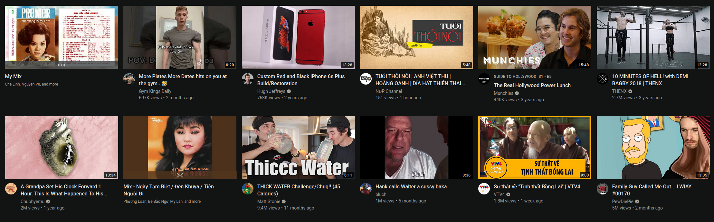
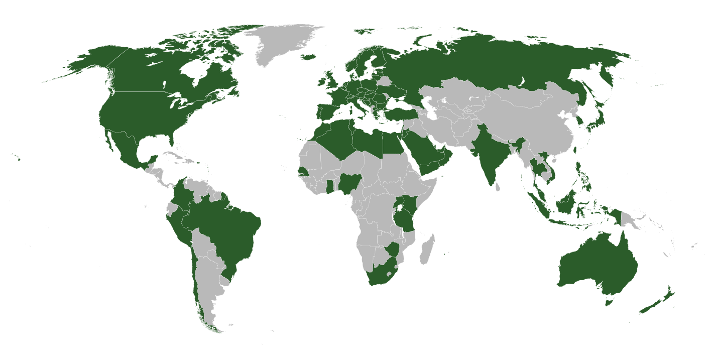

### Introduction

YouTube is one of the largest online video sharing websites in the world, and is currently owned by Google. It was Launched in February 2005 by Steve Chen, Chad Hurley, and Jawed Karim. When someone makes a YouTube account and watches several videos, on the homepage, several thumbnails for recommended videos will be shown on screen. My homescreen is shown on the figure below. 

The recommendations shown on Figure 1 are a result of my watching habits on YouTube. Recently, I have been exercising at the local gym, and while at the gym, I usually listen to Vietnamese music, which is why there are fitness videos and Vietnamese music videos on my recommendations. The rest of the recommendations are a result of watching YouTube videos that I would find interesting before I would sleep at night. But what metrics are used to determine whether or not I will enjoy these videos? When looking at the Youtube recommender system, we will see that there are multiple metrics involved.

In this report, we delve into the recommender system for YouTube. We will perform a scenario design analysis and consider if it makes sense to perform the scenario design analysis twice, once for the organization and once for the organization's customers.  We will also investigate how the recommender system able to generate recommendations based on certain criteria and include specific recommendations on how to improve the site's recommendation capabilities going forward.

### Scenario Design Analysis

The first question that we should ask ourselves in a scenario design analysis is who are our target users. YouTube seeks to provide different types of videos for people all around the world, basically the general public. The community guidelines, however, do place limits on what kind of audiences YouTube is targeting. In other words, non-target users include those looking for videos involving spam & deceptive practices, sensitive content, violent or dangerous content, regulated goods, and misinformation. More specific examples can be found on the [YouTube Community Guidelines](https://www.youtube.com/howyoutubeworks/policies/community-guidelines/). YouTube serves as a platform for opinion expression, information sharing, and content creation. YouTube has a localized version for 104 countries as shown in the figure below, which shows just how large of a population YouTube is accessible for. The largest country that has no access to YouTube is China, as a result of its internet censorship laws. The country has actually circumvented this by developing its own video sharing platforms as a result of YouTube being so popular around the rest of the world.

The second question that we should ask ourselves is what are the key goals of our target users. In actuality there are two different types of target users that YouTube caters to; content creators and viewers. Some of the key goals of the viewers include obtaining second opinions, being informed on local, national, and global news, avoiding misinformation, connecting with other viewers and establishing a community, or simply to construct a playlist for a party to name a few. Youtube is in the business of consumption of media, and that is what the key goal is for its viewers, the consumption of media. For the content creators, the key goals include using Adsense to generate revenue from YouTube videos, to create new trends, offer professional opinions, and establish a brand, to name a couple.

The third question that we should ask ourselves is how can YouTube help the target users accomplish their goals? In order to address many of key goals for viewers and content creators, YouTube established a recommender system in 2008 which seeks to personalize recommendations based on several metrics. The recommender system is essentially a machine learning model that operates through 4 different metrics which build upon each other:

- Clicks
- Watchtime
- Survey Responses
- Sharing, Likes, and Dislikes

These metrics are further explained in the next section.

### Reverse Engineering YouTube

An online literature review revealed that seveal metrics were used to establish the recommender system. One such metric includes monitoring a person's clicks on a video. For this metric, the simple clicking of a video will indicate to the recommender system that the viewer wants to watch this video, and more videos like it. The recommender system also monitors the watchtime for a video, to circumvent the problem of those who either accidentally clicked on a video, or only watched a few seconds of the video, thinking it was something else. Another metric that is used in the recommender system is survey responses. After a viewer has watched a video, a survey will be brought up on the screen asking the viewer how satisfied they were with the video on a scale from 1 to 5. These survey responses are necessary in order to gauge satisfactory videos against unsatisfactory videos. Finally, sharing, likes, and dislikes are used in the recommender system because people generally only share or like videos that they really enjoy, so those videos that a viewer has shared or liked can be used in the recommender system to recommend similar videos. These metrics are also important for content creators because they allow the content creators to publish more content that is consistently being shared, have long watchtimes, rated highly, or have high like to dislike ratios.

The recommender system also applies clustering in the form of user-user collaborative filtering. What this essentially is, is that users with similar tastes are clustered together with one another in the recommender system. So users who like to listen to jazz fusion will be lumped together, and what the recommender system will reveal is that many of the people in this cluster also enjoy tennis videos. The recommender system will then recommend jazz fusion along with tennis videos, even if you have never watched a tennis video, as a way of introducing you to new content.

Youtube also includes a favorites system, which allows you to place videos in a "Favorites" playlist. While I could not find any information on whether or not the favorties system had any influence on the recommender system, it most likely does have influence on how videos are recommended to a user, based on the fact that the act of watching videos on YouTube, by its very nature, feeds information to the recommender system.

### Performing Scenario Design Twice?
The next question to ask ourselves is whether or not it makes sense for the selected recommender system to perform scenario design twice, once for the organization, and once for the organization's customers. I think it would make sense for the selected recommender system to perform scenario design twice for the organization and the content creators, but not for the organization and the viewers. The reason why I say this is because the recommender system would benefit the content creators for their own channels. Through the recommender system, they would know the ratio of likes to dislikes for their videos, what types of people are sharing their videos, the survey responses for their videos, and the watchtime for their videos. They could then use this data in order to deliver content that would get them the more viewers and more ad-revenue.

### Recommendations for the Recommender System

I did not see any of the metrics being "Subscriptions". Allow me to elaborate on what a subscription is. A viewer can subscribe to a content creator, and there is a section on the YouTube front page for a viewer's subscriptions. This could be potentially another metric that could be used in the recommender system if it is not already. On the YouTube Wikipedia page, it says that the website "has been criticized for facilitating the spread of misinformation, copyright issues, violating its users' privacy, enabling censorship, and endangering child safety and well being". I believe that the recommender system is able to prevent these types of videos from being recommdended, but if a bunch of people are highly rating a video with a bunch of misinformation for example, this is a problem for the recommender system, and should be taken into account.

### References

An introduction to recommender systems (+9 easy examples). Iterators. Retrieved November 5, 2021, from https://www.iteratorshq.com/blog/an-introduction-recommender-systems-9-easy-examples/.

Goodrow, C. (2021, September 15). On YouTube's recommendation system. blog.youtube. Retrieved November 5, 2021, from https://blog.youtube/inside-youtube/on-youtubes-recommendation-system/. 

Wikimedia Foundation. (2021, October 31). YouTube. Wikipedia. Retrieved November 5, 2021, from https://en.wikipedia.org/wiki/YouTube. 